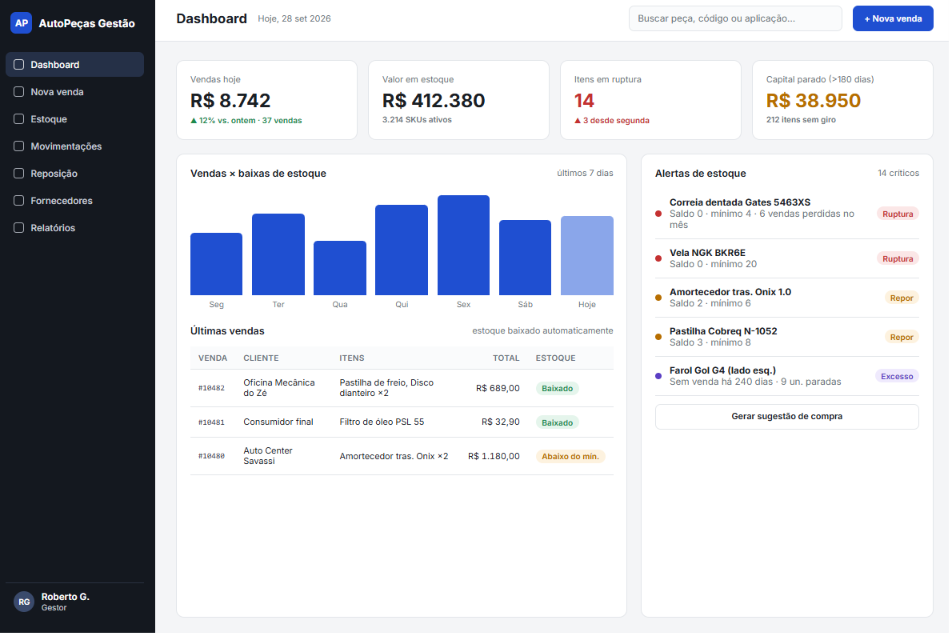
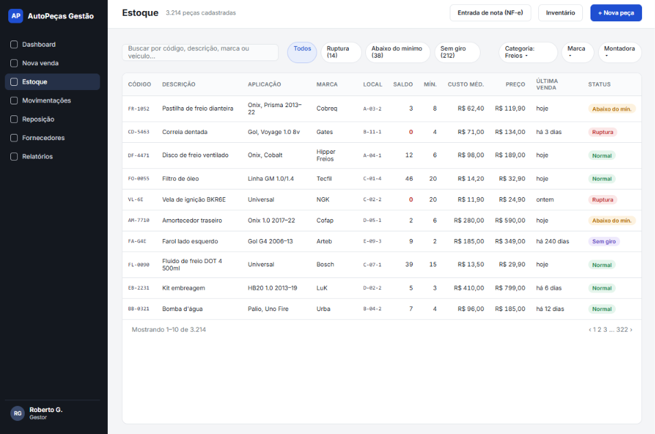
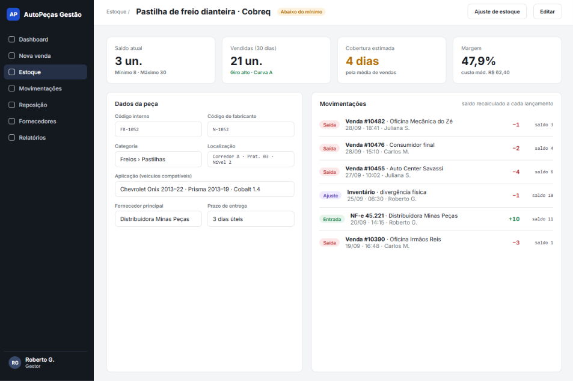
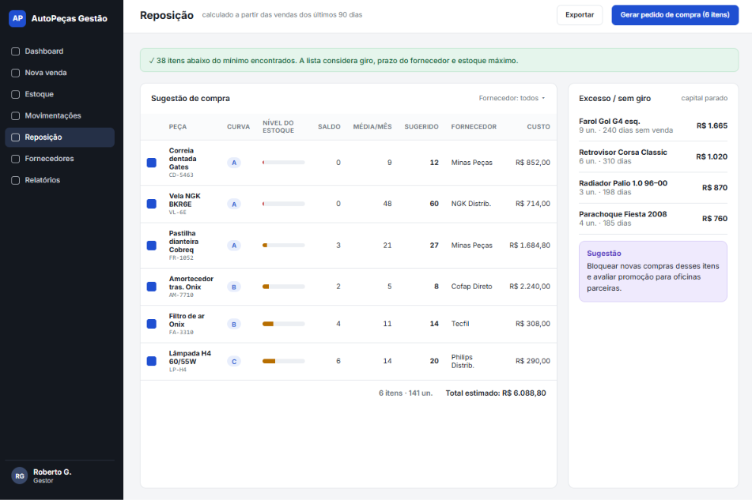
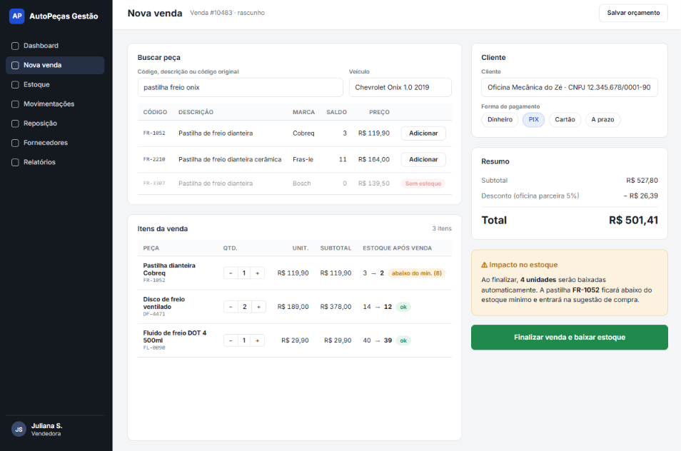

# Sistema Integrado de Gestão Empresarial (SIGE) — Comércio de Autopeças

> Projeto desenvolvido para a disciplina **Trabalho Interdisciplinar: Sistemas Integrados de Gestão Empresarial (TI: SIGE)** — Curso de Sistemas de Informação.

---

## 📑 Sumário

- [Sobre o Projeto](#-sobre-o-projeto)
- [Objetivos do Sistema](#-objetivos-do-sistema)
- [Processos de Negócio Cobertos](#️-processos-de-negócio-cobertos-bpmn--visão-erp)
- [Tecnologias Utilizadas](#️-tecnologias-utilizadas)
- [Como Executar o Projeto](#-como-executar-o-projeto)
- [Estrutura do Repositório](#-estrutura-do-repositório)
- [Documentação Completa](#-documentação-completa)
- [Protótipos de Tela](#-protótipos-de-tela)
- [Status do Projeto](#-status-do-projeto)
- [Professor Orientador](#-professor-orientador)
- [Integrantes da Equipe](#-integrantes-da-equipe)
- [Licença](#-licença)

---

## 📌 Sobre o Projeto

O setor de varejo de autopeças lida com alta diversidade de itens e rápida obsolescência, o que torna o controle manual ou descentralizado (planilhas isoladas, controle em papel etc.) altamente propenso a divergências entre o estoque físico e o saldo registrado no sistema.

Esse descompasso gera dois problemas recorrentes na operação:

- **Ruptura de estoque** — o cliente procura um item que, na prática, não está disponível;
- **Excesso de mercadorias paradas** — capital imobilizado em produtos sem giro.

Este projeto propõe uma aplicação de gestão empresarial com foco na **integração direta entre os processos de Vendas e Controle de Estoque**, automatizando baixas, reservas e atualizações em tempo real, de forma a reduzir divergências e oferecer aos gestores uma visão única e confiável da operação.

---

## 🎯 Objetivos do Sistema

- **Integração Vendas ↔ Estoque** — baixa e reserva automática de peças no fechamento de pedidos de venda, eliminando a atualização manual do saldo.
- **Centralização de Dados** — substituição de planilhas isoladas por uma base única, garantindo visão unificada das operações.
- **Controle Operacional** — histórico de movimentações de estoque, alertas de nível crítico e suporte à tomada de decisão de compras e reposição.

---

## ⚙️ Processos de Negócio Cobertos (BPMN / Visão ERP)

| Processo | Descrição |
|---|---|
| **Gestão de Catálogo e Estoque** | Cadastro de componentes, compatibilidade entre peças e controle do saldo físico. |
| **Processamento de Vendas** | Emissão de pedidos, conferência de disponibilidade em tempo real e baixa automática de saldo. |
| **Aquisição e Reposição** | Registro de entrada de insumos com atualização automática do almoxarifado. |

---

## 🛠️ Tecnologias Utilizadas

| Camada | Tecnologia |
|---|---|
| **Backend** | *.Net / C#* |
| **Frontend** | *HTML/CSS/JS* |
| **Banco de Dados** | *MySQL* |
| **Modelagem de Processos** | Camunda / Bizagi (BPMN) |

---

## 🚀 Como Executar o Projeto

### Pré-requisitos

- [Git](https://git-scm.com/)
- SDK .Net

### Passo a passo

1. Clone o repositório:
   ```bash
   git clone https://github.com/Leonardo-Leonhardt/erp-autopecas-sige.git
   ```

2. Acesse a pasta do projeto:
   ```bash
   cd erp-autopecas-sige
   ```

3. Restaure as dependências:
   ```bash
   dotnet restore
   ```

4. Configure as variáveis de ambiente / string de conexão do banco de dados (`.env` ou `appsettings.json`).

5. Execute as migrations do banco de dados:
   ```bash
   dotnet ef database update
   ```

6. Inicie a aplicação:
   ```bash
   dotnet run
   ```

---

## 📂 Estrutura do Repositório

```
erp-autopecas-sige/
├── docs/
│   ├── artigo/       # Texto do TCC/artigo (introdução, referencial teórico, metodologia etc.)
│   │   └── TI_SIGE.pdf
│   └── diagramas/    # Diagramas UML, BPMN e casos de uso
│   └── imagens/      # Imagens do projeto
├── src/              # Código-fonte da aplicação
├── tests/            # Testes automatizados
└── README.md
```

---

## 📚 Documentação Completa

O texto completo do trabalho acadêmico estará disponível em [`docs/artigo/TI_SIGE.pdf`](docs/artigo/TI_SIGE.pdf).

Diagramas UML, BPMN e casos de uso ficarão em [`docs/diagramas/`](docs/diagramas/). [A fazer]

---

## 📸 Protótipos de Tela

| Dashboard | Estoque | Produto |
|---|---|---|
|  |  |  |

| Reposição | Vendas |
|---|---|
|  |  | 

---

## 📈 Status do Projeto

🚧 Em desenvolvimento — projeto acadêmico em andamento.

---

## 🧑‍🏫 Professor Orientador

- Paulo Augusto Isnard Santos

---

## 👥 Integrantes da Equipe

- Arthur Vinícius Reis Rodrigues
- Emanuela Vitória Magalhães Alves
- Fantine de Fatima Bonfim
- Giovanna Ribeiro Santos
- Kayk da Silva Souza
- Leonardo Leonhardt Bispo
- Rodrigo Fernandes Ribeiro Pinto
- Yanne Assis Alves

---

## 📄 Licença

*Uso exclusivo acadêmico*
